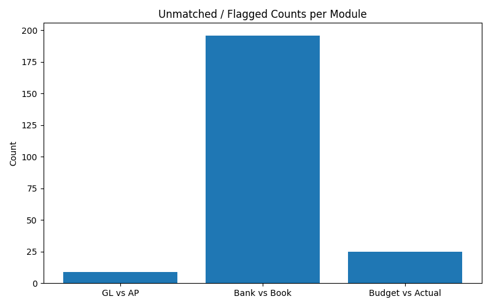

# 📊 Accounting Reconciliation & Reporting Suite

A modular Python project that simulates enterprise-level accounting reconciliation workflows using mock datasets. Designed to reduce manual effort, improve transparency, and build a strong foundation for future automation and AI integration.

---

## 📁 Project Structure

```
accounting-suite/
├── app/
│   ├── main.py                         # One-click execution script
│   └── reconciliation/                # Reconciliation logic modules
│       ├── gl_vs_ap.py
│       └── bank_vs_book.py
├── Budget/
│   └── variance_budget_actual.py      # Budget vs Actuals logic
├── data/
│   ├── *.csv                          # Input and output data files
│   ├── outputs/                       # Generated reports
│   └── pictures/                      # Chart exports
├── generate_data/                    # Scripts to create fake datasets
│   └── generate_data_*.py
├── requirements.txt
├── README.md
└── TODO.md
```

---

## ✅ Features

- **GL vs AP Reconciliation**  
  Match general ledger entries against posted accounts payable totals.

- **Bank vs Book Reconciliation**  
  Match internal cash records with external bank transactions based on date and amount tolerances.

- **Budget vs Actual Variance**  
  Compare budgeted vs actual spend by account, cost center, and period. Flags large variances.

- **One-click Automation (`main.py`)**  
  Runs all reconciliations and outputs a table summary, CSV report, and variance chart.

---

## 🚀 How to Run

1. Clone the repo and navigate to the root.
2. (Optional) Create a virtual environment.
3. Install dependencies:

```bash
pip install -r requirements.txt
```

4. Run everything in one go:

```bash
python app/main.py
```

---

## 📦 Outputs

- 📁 `data/outputs/`  
  Contains CSV files for mismatches, variances, and the summary report.

- 📁 `data/pictures/`  
  Contains saved charts (e.g. reconciliation_chart.png)

---

## 📅 Sprint 1 Checklist

| Task                       | Status |
|----------------------------|--------|
| Data Generation Scripts    | ✅     |
| GL vs AP Reconciliation    | ✅     |
| Bank vs Book Reconciliation| ✅     |
| Budget vs Actual Variance  | ✅     |
| One-click Runner (main.py) | ✅     |
| Summary Report & Chart     | ✅     |

---

### 💡 Future Add-ons & AI Roadmap
## 🔧 Phase 1: Local AI Assistant (CSV-based)
- Reads datasets from the codebase (data/*.csv)
- Compares, detects mismatches, and auto-aligns values across related files
- Generates detailed mismatch reports and corrections

## 🛢️ Phase 2: Oracle DB Integration
- Mirror all CSV structures as Oracle tables
- Load CSVs into Oracle via Python or SQL*Loader
- AI shifts from file-based reconciliation to querying Oracle directly
- Automatically updates mismatched records inside the database

## 🧠 Phase 3: Intelligent Correction Engine
- AI assistant explains why mismatches occurred
- Offers human-readable reasoning before correction
- Writes back changes with logs and traceability

## 📊 Optional Future UI
- Power BI for dashboards
- Flask or React frontend for local interaction
- Button-based execution and reporting interface

---

## 🤝 Contact

For questions or feedback: *[Your Name or GitHub handle]*  


---

## 📈 Sample Output Chart

This chart shows the number of unmatched or flagged records from each module:


